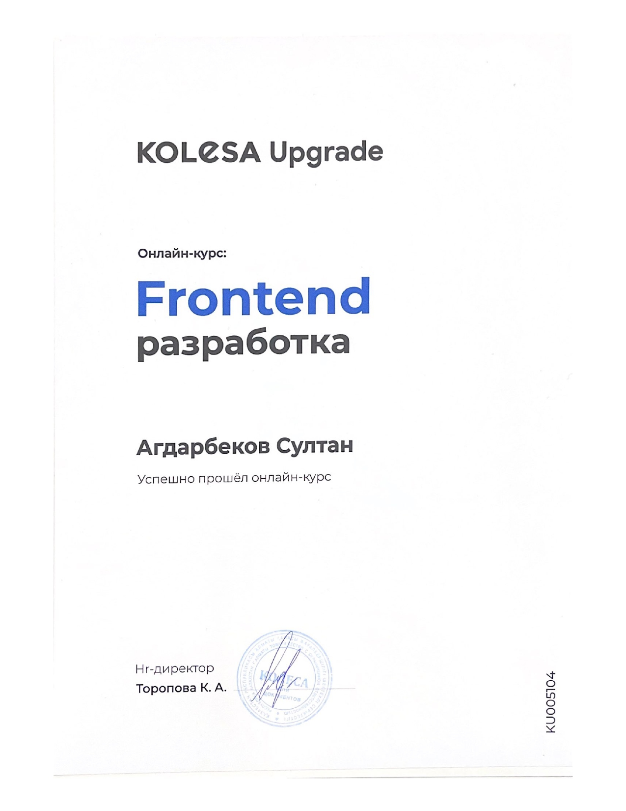

## Sultan Agdarbekov

_Computer Science student_

### Contacts

**Mobile phone:** +77010718448  
**Email:** agdarbekovsultan@gmail.com  
**[Github](https://github.com/soola-sys)**  
**[Gitlab](https://gitlab.com/soola-sys)**  
**[LinkedIn](https://www.linkedin.com/in/sultan-agdarbekov/)**

### Objectives

I am proactive , motivated to constantly develop personal skills and grow professionally, also stress-resistant , i enjoy coding , solving challenging tasks and learning from them , currently looking for starting my career as Frontend Developer

### About me

 **Technical Skills:** Java , Python , C++ , MySQL , LATEX  
 **Languages:** Fluent in Russian , Kazakh Native , English Upper Intermediate  
 **Interest:** PC - Hardware , IT Specialist , Basketball  
 **Web Programming:** HTML / CSS (SCSS) / Javascript , VueJs , Jest , GIT , ReactJs - Basic , Tilda , LP motor
### Education History

**International Information Technology University**  
_(August 2018 - Present)_

- Studying Bachelor of Computer Science
- Graduation year 2022
- Grade Point Average : 3,43 from 4

**Kolesa Upgrade ( Frontend Development course)**  
_(September 2021 - November 2021)_

1. Working with mentors
2. Laylout using HTML CSS ( SCSS )
3. Add Functionality to Project using Javascript
4. Move Project to Vue Js 2.0 + Vuex
5. Testing using Jest Framework
6. Learned how to use best practices

**Code Example**  
Task which converts boolean to string

```
function booleanToString(b){
 let y = b.toString();
  return y;
}
```

**Courses**

Frontend development by [Kolesa Group](https://job.kolesa.kz/) company


